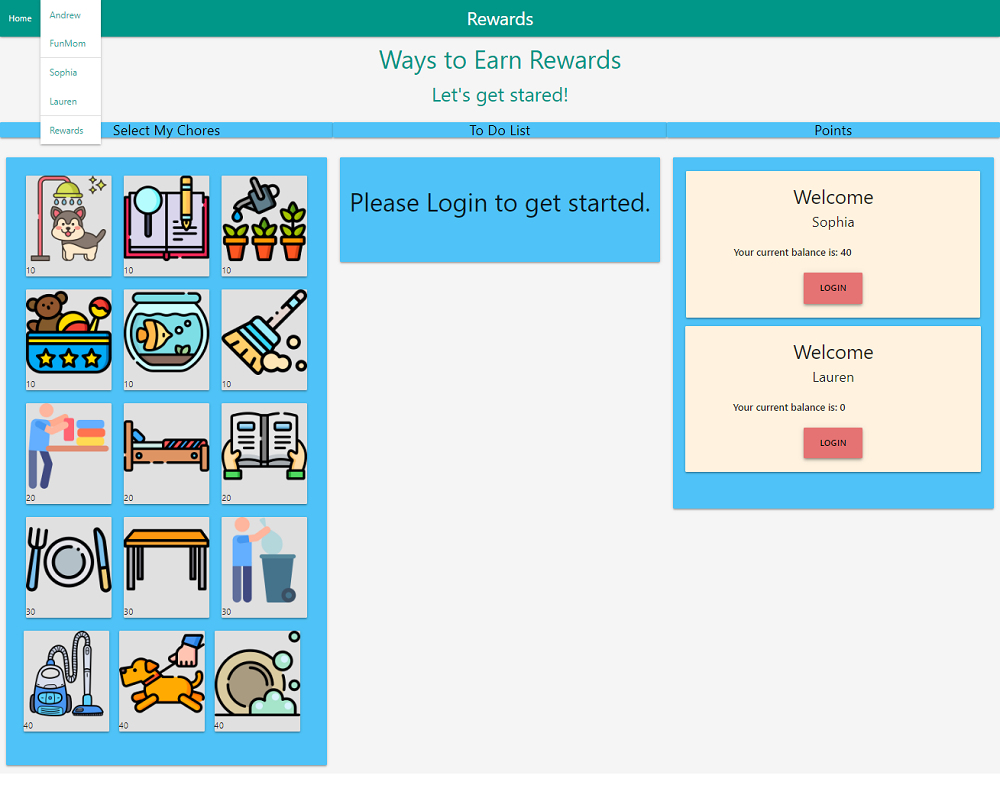
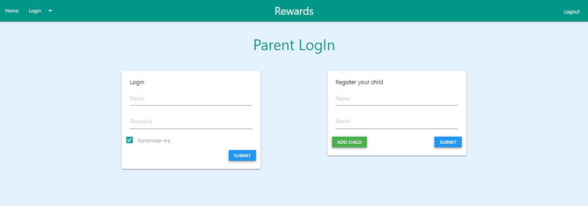
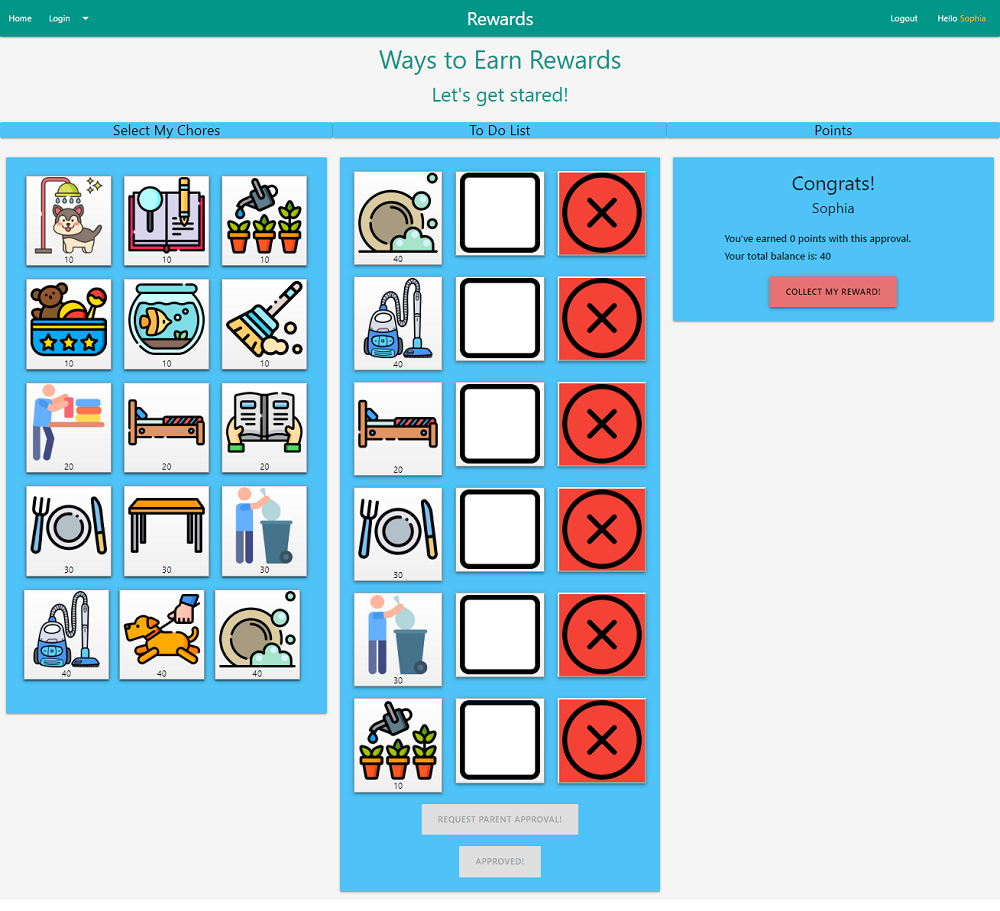
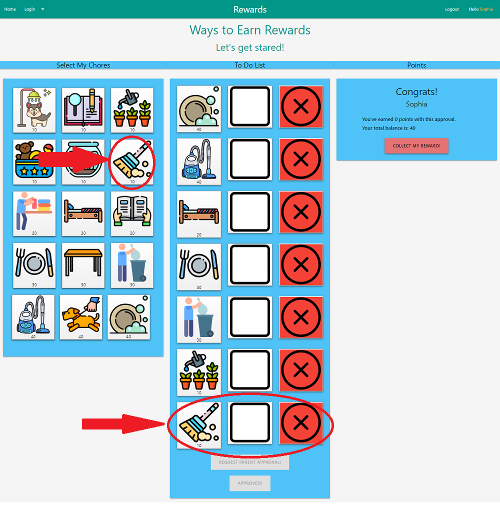
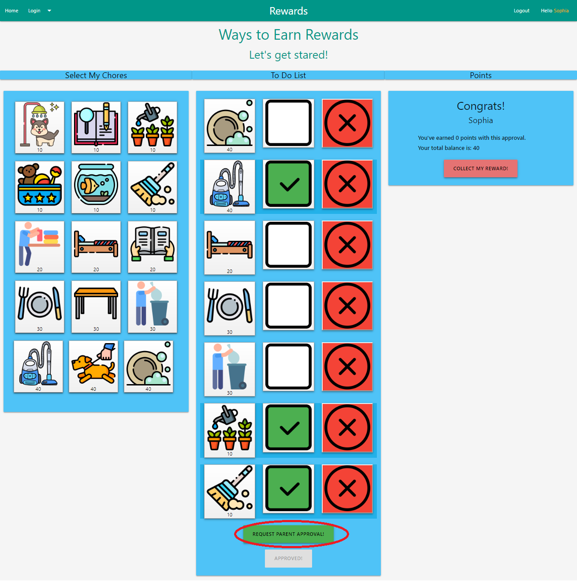
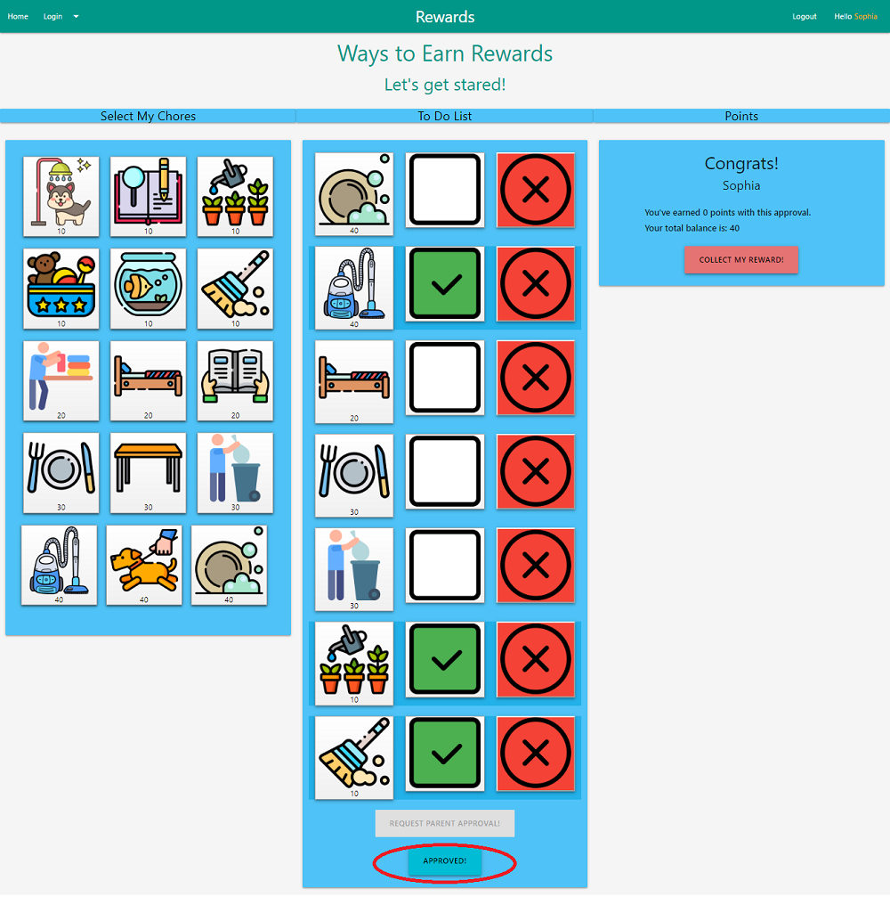
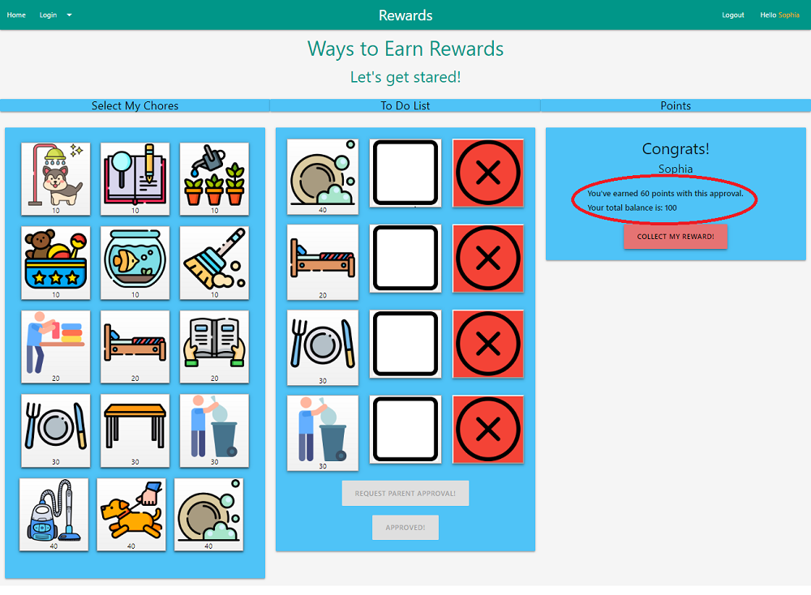
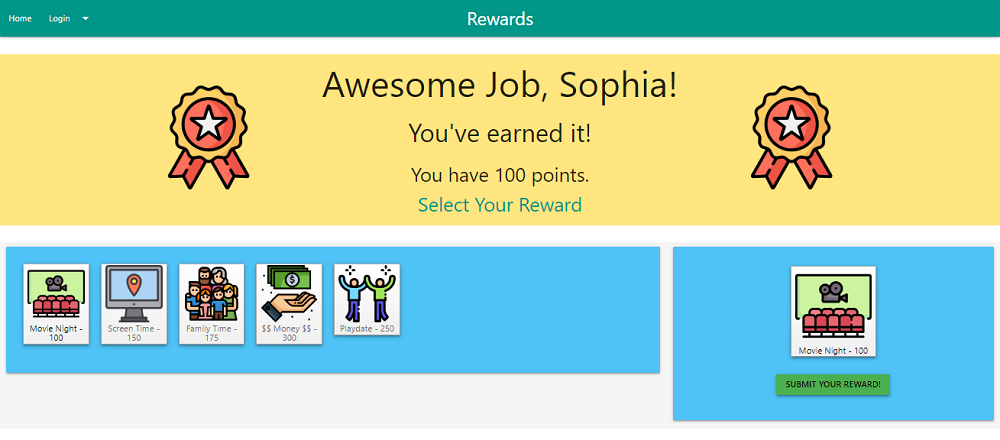
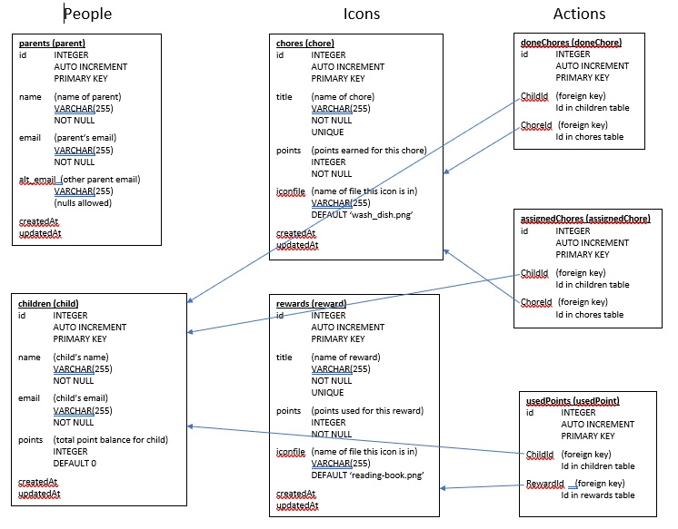

### Rewards App
- Link to Heroku deployed app:   [Heroku Rewards link](https://enigmatic-caverns-81757.herokuapp.com/)
- Link to Github page:   [Github Rewards page](https://github.com/MauraSlavin/rewards)

This is an interactive user-friendly app to assign, track and reward chores done.  Geared towards children 12yrs and under.

### Technology used
        - Materialized CSS
        - MySql Database & Sequelize
        - Mailtrap
        - Kanban project tracking method used
        - Nodemailer
        - Express
        - Node js

### Useful Features:
        - Heroku-deployed
        - Lots of fun, colorful icons and background colors to get children excited and motivated

### How to use this app
        - Visit https://enigmatic-caverns-81757.herokuapp.com to get started.
        - From the landing page both child(ren) and parent(s) log in to get started
            -- Parent's and Child's information retrieved from parents and children tables, respectively.

        - From the dropout menu Parent logs in to register/add child, assign chores, and approves chores that have been marked as complete.

        - Child logs in onto his/her own personalized page to be able to get started
        

## CHILD page:
Child's name in navbar ("<child>'s Rewards" rather than just "Rewards" on the green bar).

### Column 1 (“Chores”):
    Starts with grid of chores icons with points, which are retrieved and built from the chores table.
    Each chore icon is clickable.
    When it is clicked:
        - Duplicate icon is added to the second column (“Chores To Do”)
          - …with blank box (becomes check mark when clicked)
          - …"remove" button.
        - In the database, a new record is added to the assignedChores table for that child and that chore.
        - This is the screen after the "sweeping" icon was clicked:

### Column 2 (“Chores to Do”):
    Starts with chores from the assignedChores table, as follows:
        Each assigned chore is on it’s own row with (each of these is clickable)
            - Icon for the chore 
            - Check mark icon
            - Remove button
        At the bottom, after the list of assignedChores, there will be:
            - Request Parent Approval button (disabled until the first checkmark is clicked),
            - Parent Approved button (disabled until the Request Parent Approval button is clicked).
    The child clicks on the checkmarks for the chores they have completed:
	    - After the first checkmark is clicked, the Request Parent Approval button is enabled
	    - Here, "vacuuming", "watering plants" and "sweeping" have been checked as being done:

    When the child has clicked on all the chores they have completed...
        - They click the “Request Parent Approval” button
        - An email is sent to the parent (this doesn't actually send, but is caught in a log)
	    - The Parent Approval button is enabled

        - Then parent physically comes to the computer and clicks the “Parent Approval” button
	        - if we had more time there would be some authentication done to make sure it was the parent
        - Then:
            - The chores disappear from the “To Do” list
            - The record is deleted from the assignedChores table for each chore done
            - A record is inserted in the doneChores table for each chore done
            - The points for the child in the children table is increased by the points earned.
            - “You have earned ?? points.” is updated in column 3
            - “You’re total balance is ??.” is updated in column 3.

### Column 3 (“Done”):
(See previous screenshot)
    - Congratulates the child
    - Tells the child how many points they’ve just earned (starts at 0 when the page loads)
    - Tells the child what their current point balance is.
    - Has a “Collect my reward” button.  When this button is clicked, it takes them to the Rewards page
	- This button is always enabled, so the child can see the list of rewards, 
        even if they don’t have enough points to choose a reward.

### Future:
    - Box under the “Congratulations” box with a log of chores done and rewards chosen.
    - Real emails will be sent

## REWARDS page:

### Dropdown list (same as CHILD page):
    Parent's name and Child's name retrieved from parents and children tables, respectively.
    Child's name is in the green nav bar row ("Hello, <child's name>” on the right side of the nav bar)

### Column 1 (rewards available to choose from):
    Starts with grid of icons with title & points, which are retrieved and built from the rewards table.
    Each reward icon is clickable, 
        and only enabled if the child has enough points for it.
    When it is clicked:
        - Duplicate icon is added to the second column
        - Submit button in column 2 becomes enabled

### Column 2 (reward chosen, but not yet submitted):
    Starts with just disabled Submit button.
    When a reward is chosen the submit button is enabled.
    When the Submit button is chosen,
	    - The parent gets an email (future – would appear on parent screen)
	    - A record is added to the usedPoints table
	    - The points is decremented by the points the reward is worth in the child table.
	    - The reward icon in the second column goes away
    	- The submit button becomes disabled.
    	- Re-render page (or at least the first column) so rewards the child no longer has enough points for are disabled.

### Database design
    Diagram of the database structure:

